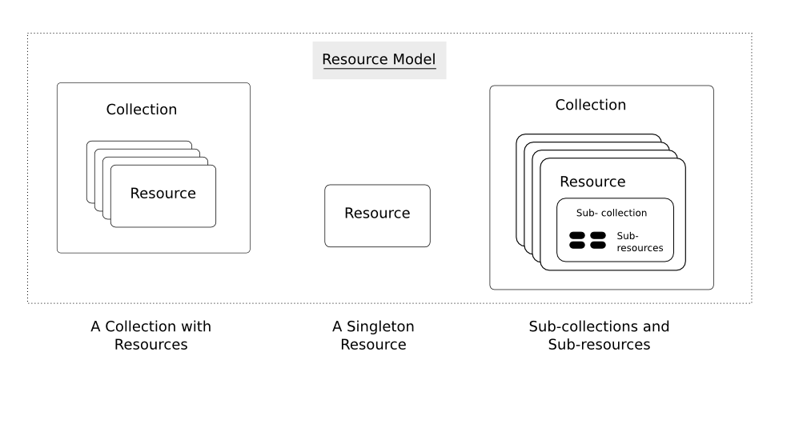

=========
Resources
=========

The fundamental concept in any RESTful API is the *resource*.  A resource is
an object with a type, associated data, relationships to other resources, and
it has a set of methods that operate on it. It is similar to an object
instance in an object-oriented programming language, with the important
difference that only a few standard methods are defined for the resource
(corresponding to the standard HTTP GET, POST, PUT and DELETE methods), while
an object instance typically has many methods.

Resources can be grouped into *collections*. Each collection is homogeneous so
that it contains only one type of resource, and unordered. Resources can also
exist outside any collection. In this case, we refer to these resources as
*singleton resources*.

Collections can exist globally, at the top level of an API, but can also be
contained inside a single resource. In the latter case, we refer to these
collections as *sub-collections*. Sub-collections are usually used to express
some kind of "contained in" relationship. We go into more detail on this in
:doc:`relationships`.

The diagram below illustrates the key concepts in a RESTful API.

We call information that describes available resources types, their behavior,
and their relationships the *resource model* of an API. The resource model can
be viewed as the RESTful mapping of the application data model.

Resource Data
=============

Resources have data associated with them. The richness of data that can be
associated with a resource is part of the *resource model* for an API. It
defines for example the available data types and their behavior.

Based on my experience, I have developed a strong conviction that the JSON
data model has just the right "richness" so that it is an ideal data model for
RESTful resources. I would recommend everybody to use it.

In JSON, just three types of data exist:

* scalar (number, string, boolean, null).
* array
* object

Scalars types have just a single value. Arrays contain an ordered list of
values of arbitrary type. Objects consist of a unordered set of key:value
pairs (also called attributes, not to be confused with XML attributes), where
the key is a string and the value can have an arbitrary type. For more
detailed information on JSON, see the `JSON web site <http://www.json.org/>`_.

Why the strong preference for JSON? In my view, JSON has the right balance
between expressiveness, and broad availability. The three types of data
(scalars, arrays and objects) are powerful enough to describe in a natural way
virtually all the data that you might want to expose as resource, and at the
same time these types are minimal enough so that almost any modern language
has built-in support for them.

XML would be the other obvious contender. Actually, in the final incarnation
of the RHEV-M API, XML is used to describe resources, via an XMLSchema
definition.  With hindsight, I believe that the XML data model is a bad choice
for a RESTful API. On one side, it is too rich, and on the other side, it
lacks features. XML, as an SGML off-shoot, is in my view great for
representing structured documents, but not for representing structured data.

Features of XML that are too rich include:

1. Attributes vs elements. An XML element can have both attributes as well as
   sub-elements. A data item associated with a resource could be encoded in
   either one, and it would not be clear beforehand which one a client or a
   server should use.
2. Relevance of order. The order between child-elements is relevant in XML. It
   is not natural in my view for objects attributes to have ordering.

The limitations of the XML data model are:

1. Lack of types. Elements in XML documents do not have types, and in order to
   use types, one would have to use e.g. XMLSchema. XMLSchema unfortunately is
   a strong contender for the most convoluted specification ever written.
2. Lack of lists. XML cannot natively express lists. This can lead to issues
   whereby it is not clear whether a certain element is supposed to be a list
   or an object, and where that element ends up being both.

Application Data
----------------

We define the data that can be associated with a resource in terms of the JSON
data model, using the following mapping rules:

1. Resources are modeled as a JSON object. The type of the resource is
   stored under the special key:value pair "_type".
2. Data associated with a resource is modeled as key:value pairs on the
   JSON object. To prevent naming conflicts with internal key/value pairs,
   keys must not start with "_".
3. The values of key:value pairs use any of the native JSON data types of
   string, number, true, false, null, or arrays thereof. Values can also be
   objects, in which case it is modeling nested resources.
4. Collections are modeled as an array of objects.

We will also refer to key:value pairs as attributes of the JSON object, and we
will be sloppy and use that same term for data items associated with resources
too. This use of attribute is not to be confused with XML attributes.

REST Metadata
-------------

In addition to exposing application data, resources also include other
information that is specific to the RESTful API. Such information includes
URLs and relationships.  

The following table lists generic attributes that are defined and have a
specific meaning on all resources. They should not be used for mapping
application model attributes.

=========  ======  ==========================================
Attribute  Type                     Meaning
=========  ======  ==========================================
id         String  Identifies the unique ID of a resource.
href       String  Identifies the URL of the current resource.
link       Object  Identifies a relationship for a resource.
                   This attribute is itself an object and has
                   "rel" "href" attributes.
=========  ======  ==========================================

Other Data
----------

Apart from application data, and REST metadata, sometimes other data is
required as well. This is usually "RPC like" data where a setting is needed
for an operation, and where that setting will not end up being part of the
resource itself.

One example that i can give here is where a resource creation needs a
reference to another resource that is used during the creation, but where that
other resource will not become part of the resource itself.

It is the responsibility of the API code to merge the application data
together with the REST metadata and the other data into a single resource,
resolving possible naming conflicts that may arise.

Representations
===============

We have defined resources, and defined the data associated with them in terms
of the JSON data model. However, these resources are still abstract entities.
Before they can be communicated to a client over an HTTP connection, they need
to be serialized to a textual representation. This representation can then be
included as an entity in an HTTP message body.

The following representations are common for resources. The table also lists
the appropriate content-type to use:

====  ===========================================================
Type          Content-Type
====  ===========================================================
JSON  | application/x-resource+json
      | application/x-collection+json
YAML  | application/x-resource+yaml
      | application/x-collection+yaml
XML   | application/x-resource+xml
      | application/x-collection+xml
HTML  text/html
====  ===========================================================

Note: all these content types use the "x-" experimental prefix that is allowed
by `RFC2046 <http://www.ietf.org/rfc/rfc2046.txt>`_.

JSON Format
-----------

Formatting of a resource to JSON is trivial because the data model of a
resource is defined in terms of the JSON model. Below we give an example of a
JSON serialization of a virtual machine::

  {
    "_type": "vm",
    "name": "A virtual machine",
    "memory": 1024,
    "cpu": {
      "cores": 4,
      "speed": 3600
    },
    "boot": {
      "devices": ["cdrom", "harddisk"]
    }
  }

YAML Format
-----------

Formatting to YAML is only slightly different from representing a resource in
JSON. The resource type that is stored under the "_type" key/value pair is
serialized as a YAML "!type" annotation instead. The same virtual machine as
above, now in YAML format::

  !vm
  name: A virtual machine
  memory: 1024
  cpu:
    cores: 4
    speed: 3600
  boot:
    devices:
    - cdrom
    - harddisk

XML Format
----------

XML is the most complex representation format due to both its complexity as
well as its limitations. I recommend the following rules:

* Resources are mapped to XML elements with a tag name equal to the resource
  type.
* Attributes of resources are mapped to XML child elements with the tag name
  equal to the attribute name.
* Scalar values are stored as text nodes. A special "type" attribute on the
  containing element should be used to refer to an `XML Schema Part 2
  <http://www.w3.org/TR/xmlschema-2/>`_ type definition.
* Lists should be stored as a single container element with child elements for
  each list item. The tag of the container element should be the English
  plural of the attribute name. The item tag should be the English singular of
  the attribute name. Lists should have the "xd:list" type annotation.

The same VM again, now in XML::

  <vm xmlns:xs="http://www.w3.org/2001/XMLSchema">
    <name type="xs:string">My VM</name>
    <memory type="xs:int">1024</memory>
    <cpu>
      <cores type="xs:int">4</cores>
      <speed type="xs:int">3600</speed>
    </cpu>
    <boot>
      <devices type="xs:list">
        <device type="xs:string">cdrom</device>
        <device type="xs:string">harddisk</device>
      </devices>
    </boot>
  </vm>

HTML Format
-----------

The exact format of a HTML response can be API dependent.  HTML is for human
consumption, and the only requirement is therefore that it be easy to
understand. A simple implementation may choose the following representation:

* For a collection, a <table> with a column per attribute where each object
  is listed in a separate row.
* For a resource, a <table> with two columns, one with all the attribute
  names, one with the corresponding attribute value.

Content-Types
=============

As can be seen above, i am advocating the use of a generic content types
"application/x-resource+format" and "application/x-collection+format". In my
view this represents the right middle ground between two extremes that are
commonly found in RESTful APIs:

Some RESTful APIs only use the "bare" XML, JSON or YAML content types. An
example of such as API is the Red Hat Enterprise Virtualization API. In this
case, the content type expresses nothing but the fact that an entity is in
XML, JSON or YAML format. In my view, this is not sufficient. Resources and
collections have some specific semantics around for example the use of "href"
attributes, "link" attributes, and types. Therefore, these are a
specialization of XML, JSON and YAML and should be defined as such.

Other RESTful APIs define a content-type for every resource type that exists
in the resource model. Examples of such APIs include for example VMware's
`vSphere Director API <http://www.vmware.com/pdf/vcd_10_api_guide.pdf>`_. In
my view, this is not proper either. Specifying detailed content types invites
both the API implementer, as well as a client implementer to think about these
types as having specific interfaces. In my view though, all resources should
share the same basic interface, which is defined by the RESTful design
principles and expressed by the "application/x-resource" content type.

One reason that is sometimes given in favor of defining detailed content types
is that this way, the content type can be associated with a specific
definition in some type definition language (such as XMLSchema). This,
supposedly, facilitates client auto-discovery because a client can know
available attributes for a certain type. I go into a lot of detail on this
topic in :doc:`forms` but the summary is that i do not agree with this
argument.

Selecting a Representation Format
---------------------------------

Clients can express their preference for a certain representation format using
the HTTP "Accept" header. The HTTP RFC defines an `elaborate set of rules
<http://www.w3.org/Protocols/rfc2616/rfc2616-sec14.html#sec14.1>`_ in which
multiple formats can be requested, each with its own priority. In the
following example, the client tells the API that it accepts only YAML input:

.. code-block:: none

  GET /api/collection
  Accept: application/x-collection+yaml
