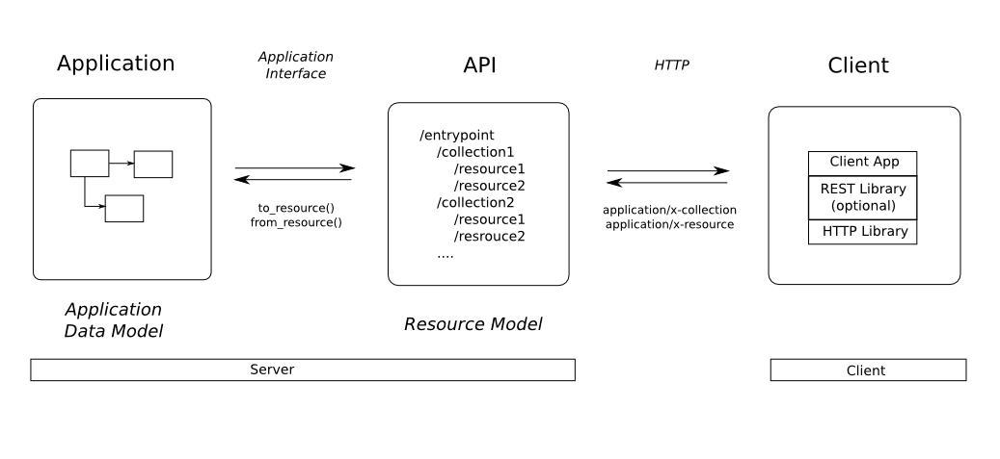

===========================
The Job of the API Designer
===========================

Before we dive fully into RESTful API design, it makes sense to look in a
little more detail what the job of a RESTful API designer is.

APIs don't exist in isolation. Instead, APIs expose functionality of an
application or service that exists independently of the API. In my view, the
job of the RESTful API designer is two-fold.

1. Understanding enough of the important details of the application for which
   an API is to be created, so that an informed decision can be made what
   functionality needs to be exposed, now it needs to be exposed, and what
   functionality can instead be left out.
2. Modeling this functionality an API that is addresses all use cases that
   come up in the real world, following the RESTful principles as close as
   possible.

There are three distinct components involved in RESTful API design: the
application, the API code, and the client. The image above illustrates how
these three components interact.

The Application
===============

The application for which an API is to be provided, exists independently of
this API. Maybe the application has a GUI, and you have a requirement to add a
programmatic interface to it. Or maybe the application was designed under the
assumption that it would be accessed only via the API you are designing.

Like any application, the application for which the API is to be created,
contains state. That state is dynamic, and will change due to various
operations that are executed on it. This state, and the operations on it, need
to be modeled and exposed, and will form the API you are designing.

The easiest way to think about the application state, is to assume that it is
is described by an *application data model*, which can be described by an
*Entity-Relationship diagram*. The ER-Diagram lists the details of the
*entities* (i will call them  *objects*) in the application state, and the
*relationships* between them.

In some cases, it is very easy to create the ER diagram. For example, in case
of a web application that stores all its state in a database, it can be
trivially created from the schema of the database. In other cases where there
is not such a precise definition, the job of the API designer becomes a little
more difficult. In such a case it would actually make sense to create an ER
diagram for the application in question. That is a useful exercise in its own
right, as it will make you understand the application you're designing the API
for better. But more importantly, it will also help you in designing a good
RESTful API. We will talk more about that in a minute. Going forward, i will
assume that an ER diagram is available.

In addition to understanding the application data model, and the operations on
it, you of course need an entry point into the application that allows you to
access and change the application state. This "way in" is fully application
dependent and could take many forms. We will call this "way in" the
*application interface*.  Formally, this application interface could be
considered an API as well. The difference is though that this interface is
usually not intended for external consumption or even fully documented.  In
order not to introduce any confusion, we will not refer to this interface as
an API: that term will be reserved for the RESTful API that is being designed.

The API Code
============

The job of the API code is to access the application state, as well as the
operations on that state, via the application interface, and expose it as a
RESTful API. In between the application interface and the RESTful API, there
is a transformation step that adapts the application data model and makes it
comply with the RESTful architecture style.

The result of this transformation would be RESTful *resources*, operations on
those resources, and relationships between the resources. All of these are
described by what we call the RESTful *resource model*.

Resources are the foundation behind any RESTful API, and we will go into a lot
of detail on them in :doc:`resources`. For now, just think of resources as
being very similar to the entities from the ER diagram (which is why I
encouraged you to create an ER diagram for your application in case it didn't
exist).

Relationships between resources are expressed as hyperlinks in the
representation of the resource. This is one of the `fundamental principles
<http://roy.gbiv.com/untangled/2008/rest-apis-must-be-hypertext-driven>`_ of
RESTful API design. Resources also respond to a very limited set of operations
(usually just 4), which is a second fundament of the RESTful architectural
style.

When transforming objects from the application data model to RESTful
resources, you may find it useful to define two utility functions:

.. function:: to_resource()

   This function is assumed to take an object from the application data model,
   and convert it into a resource.

.. function:: from_resource()

   This function is assumed to take a resource, and translate it into
   an object in the application data model.

We don't discuss these methods further, other than mentioning that these can
be rather simple functions if the application data model is similar to the
resource model you're exposing, and can be quite complicated if they are very
different.

The Client
==========

The client consumes the RESTful API via the standard HTTP protocol. In theory,
the service could be provided on top of other protocols as well. However,
since HTTP is so ubiquitous, it is not sure how valuable such a mapping to
another protocol would be in the real world. Therefore, this essay limits
itself to describing our RESTful protocol in terms of HTTP.

Clients would typically use an HTTP library to access the RESTful API. HTTP
has become a moderately complex protocol, and very good libraries exist for
many target platforms / languages. It therefore makes a lot of sense to use
one of those libraries.

In some cases, it may make sense to use a generic REST library on top of an
HTTP library. However, since there are so many different conventions in
RESTful APIs, this library may actually be specific to the API that you are
consuming.
